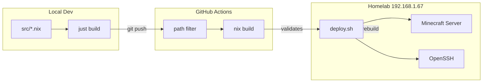

# NixOS Homelab

[](https://github.com/James-Nguyen-827/NixOS/actions/workflows/build.yml)
[](https://nixos.org/)
[](https://nixos.wiki/wiki/Flakes)
[](https://nixos.org/)

> Declarative infrastructure for a self-hosted homelab — reproducible system builds,
> automated CI validation, one-command remote deploys, and a modded Minecraft server
> installed from Modrinth on first boot.

## Highlights

| Highlight | Why it matters |
| --- | --- |
| Flake + modular Nix | Reproducible, version-pinned infrastructure as code |
| CI-gated builds | Configuration validated before it ever hits the server |
| Custom modpack pipeline | Go module vendored in Nix; first-boot installs from Modrinth |
| Remote deploy | Push-to-apply workflow via SSH |
| SSH hardening | Key-only authentication, no passwords |

## Architecture



## Services

| Service | Details |
| --- | --- |
| **Minecraft** | Fabric modpack server (1.21.1), 12 GiB heap, port 25565, data at `/var/lib/minecraft` |
| **OpenSSH** | Key-only auth; root login set to `prohibit-password` |
| **OpenRGB** | Boot-time RGB off via custom systemd oneshot |
| **NetworkManager** | Network management |
| **systemd-boot** | EFI boot loader |
| **AMD microcode** | CPU firmware updates via redistributable firmware |

The Minecraft server runs a Fabric modpack installed from Modrinth on first boot. Subsequent starts reuse the existing installation in the data directory.

## Project Structure

```
flake.nix                  # Flake entry, nixpkgs pin
justfile                   # build + deploy recipes
src/
  configuration.nix        # Core system config
  hardware-configuration.nix
  user.nix                 # User accounts, zsh
  ssh.nix                  # SSH hardening
  minecraft.nix            # Modded Minecraft server + mrpack-install
.github/workflows/build.yml
```

## Quick Start

### Prerequisites

- [Nix](https://nixos.org/download.html) with flakes enabled
- [just](https://github.com/casey/just) command runner
- SSH access to the homelab at `192.168.1.67`

### Workflow

```bash
# 1. Validate the configuration builds locally
just build

# 2. Commit and push your changes
git add -A && git commit -m "your message" && git push

# 3. Deploy to the homelab
just deploy
```

`just deploy` SSHes into the homelab and runs `~/deploy.sh`, which pulls the latest remote configuration and applies it with `nixos-rebuild switch`.

> **Note:** `deploy.sh` lives on the homelab host, not in this repository. Changes must be committed and pushed before deploying — the remote script pulls from the Git remote, not your local working tree.

## Minecraft Server

The modded Minecraft server is the most involved part of this configuration. Instead of using a stock NixOS Minecraft package, the setup vendors [`mrpack-install`](https://github.com/nothub/mrpack-install) as a Nix derivation and wraps it in a custom startup script.

**How it works:**

1. On first boot, the startup script detects no server JAR and runs `mrpack-install` to download a Fabric modpack from Modrinth into `/var/lib/minecraft`.
2. The EULA is auto-accepted.
3. The server launches via JDK 21 with a 12 GiB heap (`-Xms12G -Xmx12G -XX:+UseG1GC`), sized for ~25 players on a 32 GB host.
4. `declarative = false` — the modpack manages `server.properties` and config files in the data directory.

First-run install logic:

```nix
if [ ! -f server.jar ] && [ ! -f fabric-server-launch.jar ]; then
  echo "First run: installing modpack (this may take a few minutes)..."
  mrpack-install <modpack-id> <version> --server-dir "$(pwd)" -v
fi
```

## Security

| Setting | Value |
| --- | --- |
| Password authentication | Disabled |
| Root login | Key-only (`prohibit-password`) |
| Sudo for wheel | Passwordless (homelab tradeoff) |

SSH authorized keys are managed declaratively in `src/ssh.nix`. No keys or secrets are stored in this README.

## CI

GitHub Actions builds the configuration on every push and pull request to `main`. A path filter ensures builds only run when `.nix` files or the flake lock change. The CI job uses the same build target as `just build`:

```bash
nix build .#nixosConfigurations.default.config.system.build.toplevel
```

---

Built with [NixOS](https://nixos.org/).
